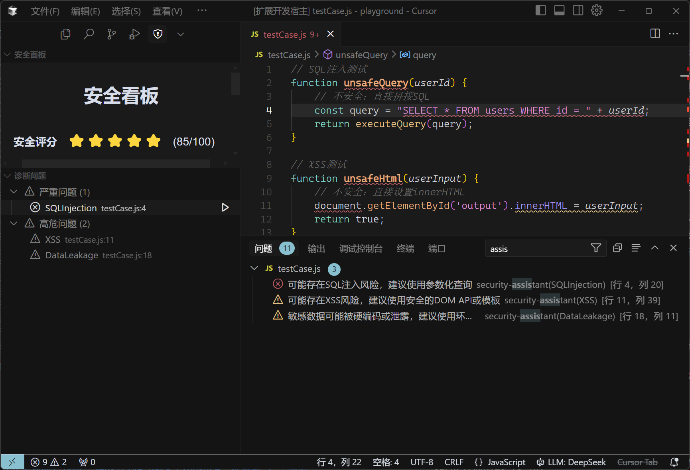

# Code Supervisor

一个为开发者提供实时编码安全建议的 VSCode 扩展，旨在帮助提高软件质量和安全性。该扩展结合了 Language Server Protocol (LSP) 和 AI 大语言模型 (LLM)，为多种编程语言提供智能安全检测和建议。



## 🚀 主要功能

### 1. 安全代码检测

- **实时检测**：在编码过程中实时检测潜在的安全问题
- **模块化规则**：内置多种安全规则，包括：
  - SQL 注入检测
  - XSS 攻击检测
  - 敏感数据泄露检测
  - 更多规则可扩展...
- **可视化提示**：通过波浪线和图标直观地标记安全问题
- **一键修复**：支持自动修复常见安全问题，如SQL注入、XSS等
### 2. 智能代码补全

- **Ghost Text 补全**：类似于 GitHub Copilot 的半透明代码补全
- **安全优先建议**：提供注重安全性的代码补全建议
- **上下文感知**：根据当前代码上下文提供相关的安全建议
- **智能去重**：自动检测并去除与已输入内容重复的部分
- **安全图标提示**：根据补全内容的安全特性显示不同的图标
- **可配置防抖时间**：优化代码补全触发时机，减少干扰

### 3. 深度代码分析

- **选区分析**：对选中的代码区域进行深度安全分析
- **详细报告**：生成包含风险说明、修复建议和最佳实践的详细安全报告
- **LLM 支持**：利用 OpenAI 或 DeepSeek 模型分析复杂的安全场景
- **诊断集成**：与VS Code原生诊断功能集成，支持问题导航和修复
- **优化界面反馈**：使用状态栏消息替代弹窗，减少干扰 🆕

### 4. AI + RAG 集成

- **知识检索增强**：使用 RAG (检索增强生成) 技术提升建议质量
- **安全知识库**：基于专业安全知识库提供针对性建议
- **上下文理解**：深度理解代码语义和安全风险
- **多模型支持**：支持切换不同的大模型提供者，包括 OpenAI 和 DeepSeek
- **自定义知识库**：支持导入自定义安全知识，增强分析能力

## 📋 支持的语言

- JavaScript/TypeScript
- Python
- Java
- PHP
- Ruby

## ⚙️ 安装与配置

### 安装前提

- VS Code 1.75.0 或更高版本
- Node.js 14.0 或更高版本

### 安装步骤

1. 克隆仓库到本地：
   ```bash
   git clone https://github.com/lonelyuan/CodeSupervisor.git
   cd security-assistant
   ```

2. 安装依赖：
   ```bash
   npm install
   ```

3. 构建扩展：
   ```bash
   npm run compile
   ```

4. 启动扩展开发模式：
   - 在 VS Code 中打开项目文件夹
   - 按 F5 启动调试模式

### OpenAI API 配置

为启用 LLM 集成功能，需要设置 API 密钥：

1. 获取 API 密钥：
   - [OpenAI API 密钥](https://platform.openai.com/)
   - [DeepSeek API 密钥](https://ark.deepseek.com/)

2. 设置环境变量：
   ```bash
   # OpenAI API
   # Linux/macOS
   export OPENAI_API_KEY=your-api-key
   # Windows
   set OPENAI_API_KEY=your-api-key
   
   # DeepSeek API
   # Linux/macOS
   export DEEPSEEK_API_KEY=your-api-key
   # Windows
   set DEEPSEEK_API_KEY=your-api-key
   ```

3. 或在 VS Code 设置中配置：
   - `securityAssistant.openaiApiKey`: OpenAI API 密钥
   - `securityAssistant.deepseekApiKey`: DeepSeek API 密钥

## 🔧 使用方法

### 代码安全检测

- 打开支持的语言文件后，扩展会自动检测潜在安全问题
- 安全问题会以波浪线形式标记在编辑器中
- 悬停在标记处可查看安全问题的详细说明
- 点击问题上的"灯泡"图标或在诊断视图中点击"修复问题"按钮可自动修复问题

### 代码补全

- 在编码过程中，扩展会提供半透明的代码补全建议
- 按 Tab 键接受建议，或继续输入忽略建议
- 使用 `Ctrl+Space` (Windows/Linux) 或 `Cmd+Space` (macOS) 手动触发补全
- 补全项左侧会显示安全相关图标，右侧显示安全提示信息
- 可使用右键菜单切换 Ghost Text 功能开关

### 代码安全分析

1. 选择需要分析的代码区域
2. 右键单击，选择 "分析代码安全性"，或使用命令面板 (`Ctrl+Shift+P` 或 `Cmd+Shift+P`) 输入 "分析代码安全性"
3. 分析结果将在侧边栏和诊断视图中显示
4. 支持工作区全量分析和单文件分析

### 诊断树视图 🆕

- 诊断树视图会按严重级别（严重、高危、中危、低危）分组显示安全问题
- 展开后可以看到每个问题的简短描述和文件位置
- 点击问题项可以直接跳转到对应的代码位置
- 点击修复按钮可以尝试自动修复问题
- 支持过滤仅显示安全相关诊断，不受其他问题干扰

### 右键菜单功能

现在可以通过编辑器右键菜单快速访问功能：

- **分析代码安全性**：分析当前选中区域的安全问题
- **当前工作区完整代码安全性检查**：对整个工作区进行安全扫描
- **当前文档完整代码安全性检查**：对当前文档进行安全扫描

### 扩展设置

在 VS Code 的设置中可以配置以下选项：

- `securityAssistant.maxNumberOfProblems`: 控制最大显示的问题数量
- `securityAssistant.enableLLM`: 启用/禁用 LLM 集成功能
- `securityAssistant.enableGhostText`: 启用/禁用 Ghost Text 代码补全功能
- `securityAssistant.ghostTextDebounceTime`: 设置 Ghost Text 防抖时间(毫秒)
- `securityAssistant.supportedLanguages`: 配置支持的语言列表
- `securityAssistant.llmProvider`: 选择大模型提供者 (openai 或 deepseek)
- `securityAssistant.openaiApiKey`: 设置 OpenAI API 密钥
- `securityAssistant.deepseekApiKey`: 设置 DeepSeek API 密钥
- `securityAssistant.customApiBaseUrl`: 设置自定义 API 基础 URL
- `securityAssistant.autoAnalyzeOnStartup`: 控制是否在启动时自动分析当前文档
- `securityAssistant.debugMode`: 启用/禁用调试模式，显示详细日志 🆕

### 切换大模型提供者

1. 点击状态栏中的 `LLM: [提供者名称]` 按钮
2. 从下拉菜单中选择所需的大模型提供者
3. 或使用命令面板 (`Ctrl+Shift+P` 或 `Cmd+Shift+P`) 输入 "切换大模型提供者"

### 添加自定义大模型提供者

1. 使用命令面板 (`Ctrl+Shift+P` 或 `Cmd+Shift+P`) 输入 "添加自定义大模型提供者"
2. 按照提示输入提供者 ID、名称、API 密钥、基础 URL 和模型名称
3. 添加完成后，新的提供者将出现在大模型提供者列表中

### 导入自定义安全知识库

1. 使用命令面板 (`Ctrl+Shift+P` 或 `Cmd+Shift+P`) 输入 "导入自定义安全知识库"
2. 选择包含安全知识的文本文件（支持 .txt、.md、.json 等格式）
3. 系统会自动处理文件并将内容导入到向量数据库中
4. 导入完成后，代码分析和建议将基于自定义知识库提供更准确的结果

### 自动修复安全问题

1. 当代码中检测到安全问题时，将在问题处显示波浪线
2. 点击诊断视图中的问题项旁边的"修复问题"按钮
3. 系统会分析问题类型并生成修复代码
4. 确认后将自动应用修复

### 调试模式 🆕

1. 在 VS Code 设置中启用 `securityAssistant.debugMode`
2. 调试模式下会在输出面板显示详细的日志信息
3. 日志包含诊断收集、分析过程、LLM请求等信息
4. 可用于排查扩展问题或了解扩展的工作流程

## 🔍 架构设计

### 整体架构

扩展基于 Language Server Protocol (LSP) 实现，分为客户端和服务器两部分：

- **客户端**：VS Code 扩展界面，处理 UI 交互和命令
- **服务器**：独立进程，处理代码分析和安全检测

### 技术栈

- **LSP**：实现语言通用性和客户端-服务器通信
- **LangChain**：AI 大语言模型集成和工作流
- **RAG**：检索增强生成，提升建议质量
- **OpenAI/DeepSeek**：提供代码理解和安全分析能力

### 用户界面优化 🆕

- **状态栏通知**：使用状态栏显示非关键信息，减少干扰
- **诊断树视图**：按严重级别分组显示问题，提供直观导航
- **简化显示**：诊断项目仅显示规则名称，避免信息过载
- **筛选功能**：支持仅显示安全相关的诊断，过滤其他类型问题

### 模块组织

```
.
├── client/ - 客户端代码
│   ├── src/
│   │   ├── extension.ts - 扩展入口点和客户端逻辑
│   │   ├── ghostText.ts - Ghost Text 实现
│   │   ├── diagnostics.ts - 诊断处理
│   │   ├── diagnosticView.ts - 诊断问题树视图
│   │   ├── analyzer.ts - 代码分析器
│   │   ├── types.ts - 类型定义
│   │   └── test/ - 客户端测试
├── server/ - 服务器代码
│   ├── src/
│   │   ├── server.ts - 服务器入口点和LSP实现
│   │   ├── securityRules.ts - 安全规则系统
│   │   ├── llmIntegration.ts - LLM集成和代码补全
│   │   ├── knowledgeBase.ts - 知识库管理
│   │   ├── documentModel.ts - 文档模型定义
│   │   ├── config/ - 配置文件
│   │   │   └── modelConfig.ts - LLM模型配置
│   │   └── test/ - 服务器测试
├── scripts/ - 构建和测试脚本
├── .vscode/ - VS Code配置
└── README.md - 说明文档
```

## 📄 文件说明

### 客户端 (client/)

- **extension.ts**: 扩展的入口点，负责初始化客户端、注册命令、创建状态栏项和启动语言服务器。主要功能包括：
  - 初始化语言客户端和服务器通信
  - 注册命令（分析代码、切换GhostText、切换LLM提供者等）
  - 创建和管理状态栏项
  - 处理用户交互和配置
  - 提供日志和状态栏通知功能 🆕

- **ghostText.ts**: 实现Ghost Text内联代码补全功能，负责：
  - 处理用户输入并发送补全请求
  - 接收服务器返回的补全项并显示
  - 智能处理重复内容，避免补全内容与已输入内容重复
  - 提供补全项的交互功能
  - 支持配置防抖时间和动态启用/禁用

- **diagnostics.ts**: 诊断处理模块，负责：
  - 收集和管理代码诊断信息
  - 格式化诊断消息
  - 提供快速修复功能
  - 处理诊断相关的用户交互

- **diagnosticView.ts**: 诊断树视图实现，负责：
  - 以树形结构展示诊断问题
  - 按严重性分类诊断问题
  - 提供问题导航和修复功能
  - 支持筛选安全相关诊断 🆕
  - 优化显示形式，简化问题标签 🆕

### 服务器 (server/)

- **server.ts**: 服务器的入口点，负责处理客户端请求和提供语言服务。主要功能包括：
  - 初始化语言服务器和通信通道
  - 处理文档变更和诊断生成
  - 提供代码补全、代码分析等核心功能
  - 集成LLM能力和安全规则

- **securityRules.ts**: 安全规则系统，负责：
  - 定义和管理安全规则
  - 对代码进行安全分析
  - 生成诊断信息和修复建议

- **llmIntegration.ts**: LLM集成模块，负责：
  - 管理与LLM的API通信
  - 处理代码补全请求
  - 提供深度代码分析功能
  - 支持多种LLM提供者和切换功能

## 📝 贡献指南

我们欢迎社区贡献，包括但不限于：

1. 报告并修复 bug
2. 增加新的安全规则和检测能力
3. 改进用户界面和体验
4. 增强文档和教程
5. 添加对新语言的支持

### 贡献步骤

1. Fork 本仓库
2. 创建功能分支 (`git checkout -b feature/amazing-feature`)
3. 提交更改 (`git commit -m 'Add some amazing feature'`)
4. 推送到分支 (`git push origin feature/amazing-feature`)
5. 创建 Pull Request

## 🔒 隐私声明

- **本地处理**：代码分析主要在本地完成，仅在需要深度分析时向LLM服务发送代码片段
- **最小数据**：仅发送必要的代码片段，不包含敏感信息
- **API密钥**：您的API密钥仅用于与OpenAI/DeepSeek服务器通信，不会被发送到其他地方

## 📄 许可证

本项目采用 MIT 许可证 - 详见 [LICENSE](LICENSE) 文件